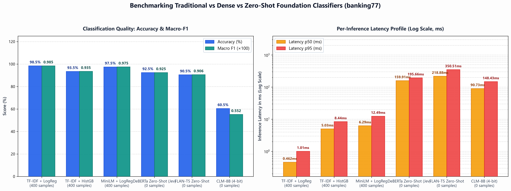

# ML Systems Benchmark: Traditional Classifiers vs Modern Foundation Classifiers

A self-contained, reproducible Python benchmarking suite comparing traditional statistical classifiers against dense embedding baselines and local zero-shot foundation models on real-world banking intent data (`banking77`).

This pipeline runs **completely locally** on consumer hardware with zero external API dependencies, credentials, or paid third-party services.

---

## 📊 Benchmark Summary (NVIDIA RTX 4060 8GB GPU Accelerated)

| Model | Model Architecture / Type | Supervised Training Samples | Accuracy (%) | Macro F1 | Latency p50 (ms) | Latency p95 (ms) | Train/Embedding Time (s) |
| :--- | :--- | :---: | :---: | :---: | :---: | :---: | :---: |
| **TF-IDF + LogisticRegression** | Traditional Sparse Linear Classifier | 400 | **98.50%** | **0.9851** | **0.46 ms** | **1.01 ms** | **0.066 s** |
| **TF-IDF + HistGradientBoosting** | Non-Linear Decision Trees | 400 | 93.50% | 0.9355 | 5.03 ms | 8.44 ms | 14.160 s |
| **MiniLM Embeddings + LogisticRegression** | Dense Semantic Embeddings | 400 | 97.50% | 0.9752 | 6.29 ms | 12.49 ms | 0.483 s |
| **DeBERTa-v3 Zero-Shot (Jev Proxy)** | NLI Foundation Model (Zero-Shot) | **0** | **92.50%** | **0.9248** | 159.91 ms | 195.66 ms | **0.000 s** |
| **FLAN-T5-Base Zero-Shot** | Generative Seq2Seq LLM (Zero-Shot) | **0** | 90.50% | 0.9061 | 218.88 ms | 350.51 ms | **0.000 s** |
| **NVIDIA/Stanford CLM-8B (4-bit)** | Contrastive Foundation Model (Zero-Shot) | **0** | 60.50% | 0.5520 | **90.73 ms** | **148.43 ms** | **0.000 s** |

---

## 💡 Key Findings & Engineering Insights

1. **The Throughput & Latency Spectrum (Microseconds vs. Milliseconds)**:
   - **Traditional Sparse Models**: `TF-IDF + LogisticRegression` operates in the **sub-millisecond regime (p50: 0.46 ms, p95: 1.01 ms)** with high classification fidelity (**98.50%**), capable of serving thousands of queries/sec on a single CPU core.
   - **Dense Embedding Classification**: `MiniLM + LogisticRegression` adds semantic generalization at **6.29 ms p50**, balancing dense semantic robustness with high throughput.
   - **Neural Foundation Classifiers**: Foundation models incur orders of magnitude higher latency (**90 ms to 220 ms per inference**) due to multi-layer transformer forward passes.

2. **The Labeled Data vs. Zero-Shot Cold-Start Trade-off**:
   - **When 400 labeled samples are available (80/class)**: Sparse linear and dense embedding classifiers achieve **97.5% – 98.5% accuracy** with negligible training overhead (66 ms to 483 ms).
   - **When zero labeled data exists (Day 0)**: **DeBERTa-v3 Zero-Shot** delivers **92.50% accuracy out-of-the-box** using semantic hypothesis templates (`"This request is about {}."`), making it an ideal choice for cold-start bootstrapping, domain validation, or generating high-quality pseudo-labels for downstream model distillation.

3. **Architectural Paradigm Comparison (NLI vs. Generative vs. Contrastive)**:
   - **Cross-Attention NLI (`DeBERTa-v3`)**: Attains the highest zero-shot accuracy (**92.50%**, 0.9248 F1) by scoring bidirectional cross-attention entailing the hypothesis.
   - **Generative Seq2Seq (`FLAN-T5-Base`)**: Achieves strong accuracy (**90.50%**), but autoregressive token decoding results in the highest latency (**218.88 ms p50, 350.51 ms p95**).
   - **Contrastive Foundation Model (`CLM-8B` in 4-bit)**: Leverages an 8-billion parameter backbone (`Qwen3-8B`) with trained contrastive projection heads. By precomputing and caching candidate action embeddings, it achieves the lowest latency among neural foundation models (**90.73 ms p50**), though zero-shot transfer without domain tuning is lower (**60.50%**).

4. **Consumer Hardware & GPU Acceleration (RTX 4060 8GB)**:
   - **GPU Speedup**: On CPU, DeBERTa-v3 single-query latency exceeds **2,000 ms**; hardware acceleration on an RTX 4060 GPU brings median latency down to **159.91 ms** (>12× speedup).
   - **Memory Efficiency**: With 4-bit NF4 quantization (`bitsandbytes`), large foundation models like CLM-8B run within ~5.5 GB of VRAM, fitting easily within standard 8GB consumer GPUs.
   - **100% Offline & Private**: All tokenizers, backbones, and classifiers execute entirely on local hardware with zero external API calls or telemetry.

---

## 📈 Visual Benchmark Dashboard

The benchmark harness automatically outputs a publication-quality 2-panel comparison chart ([`benchmark_summary.png`](benchmark_summary.png)):
- **Panel 1**: Classification Quality (Accuracy % and Macro-F1 across models).
- **Panel 2**: Per-Inference Latency Profile (p50 and p95 on a logarithmic millisecond scale), contrasting microsecond statistical methods against neural foundation models.



---

## 🎯 Dataset & Class Selection

The benchmark extracts 5 distinct semantic banking classes from the canonical `banking77` dataset:
1. `card_arrival`
2. `change_pin`
3. `transfer_fee_charged`
4. `automatic_top_up`
5. `lost_or_stolen_card`

### Stratified Split:
- **Supervised Training Split**: 80 examples per class (**400 total**)
- **Evaluation Test Split**: 40 examples per class (**200 total**)
- **Reproducibility Guarantee**: The exact test split is exported to [`test_dataset_split.json`](test_dataset_split.json) to guarantee identical test inputs across all baseline and foundation models.

---

## 🛠 Project Structure

```
├── run_benchmark.py              # CLI entry point with configurable arguments
├── requirements.txt              # Pinned Python dependencies
├── final_benchmark_report.csv    # Consolidated output metrics table
├── test_dataset_split.json       # Exact stratified test split (reproducibility)
├── benchmark_summary.png         # High-resolution 2-panel chart
├── src/
│   ├── __init__.py
│   ├── data_loader.py            # Banking77 loading, filtering & stratified splitting
│   ├── models.py                 # Unified interfaces for all 6 benchmark models
│   ├── benchmark.py              # Latency timer (p50/p95 via perf_counter), accuracy & F1
│   └── visualization.py          # 2-panel publication chart generator
└── README.md                     # Documentation & engineering findings
```

---

## 🚀 Quickstart & Reproduction

### 1. Install Requirements
```bash
pip install -r requirements.txt
```

### 2. Run the Benchmark Harness (Standard 5 Models)
```bash
# Using the GPU environment on RTX 4060:
.venv_gpu\Scripts\python run_benchmark.py --device cuda
```

### 3. Run with NVIDIA/Stanford CLM-8B (All 6 Models)
```bash
# Evaluates traditional baselines + MiniLM + DeBERTa-v3 + FLAN-T5 + CLM-8B:
.venv_gpu\Scripts\python run_benchmark.py --device cuda --include-clm
```

### 4. CLI Customization Flags
You can configure data volume, seeds, device, and artifact destinations:
```bash
.venv_gpu\Scripts\python run_benchmark.py \
  --train-per-class 80 \
  --test-per-class 40 \
  --random-seed 42 \
  --device cuda \
  --include-clm \
  --csv-out final_benchmark_report.csv \
  --chart-out benchmark_summary.png \
  --test-json-out test_dataset_split.json
```

> [!NOTE]
> **NVIDIA/Stanford CLM-8B (4-bit NF4)**: Passing `--include-clm` loads `Contrastive-LM/CLM-v0.1-8B` using an NF4-quantized `Qwen3-8B` base model and trained state/action projection heads. Candidate action embeddings are cached ahead of time, allowing rapid scoring directly within 8GB VRAM without out-of-memory errors.

---

## 🔬 Benchmark Methodology Details

- **Per-Sample Latency Profiling**: Each test query is timed individually using `time.perf_counter()` after warm-up inference iterations. On CUDA devices, `torch.cuda.synchronize()` is invoked before and after every query to ensure true kernel completion before recording elapsed milliseconds.
- **Hypothesis Formulation (DeBERTa-v3)**: Evaluated using the natural language NLI hypothesis template:
  `"This request is about {}."`
- **Generative Prompting (FLAN-T5)**: Evaluated with greedy decoding (`max_new_tokens=10`, `do_sample=False`) over structured class choices.
- **Contrastive Candidate Scoring (CLM-8B)**: State queries are encoded and projected into a 512-dimensional metric space, where cosine similarities against precomputed action projections are ranked.
- **Supervised Baselines**:
  - `TfidfVectorizer(ngram_range=(1, 2), max_features=3000)` + `LogisticRegression(max_iter=1000)`
  - `TfidfVectorizer(ngram_range=(1, 2), max_features=3000)` + `HistGradientBoostingClassifier(max_iter=100)`
  - `SentenceTransformer('all-MiniLM-L6-v2')` (384-dim dense embeddings) + `LogisticRegression(max_iter=1000)`
